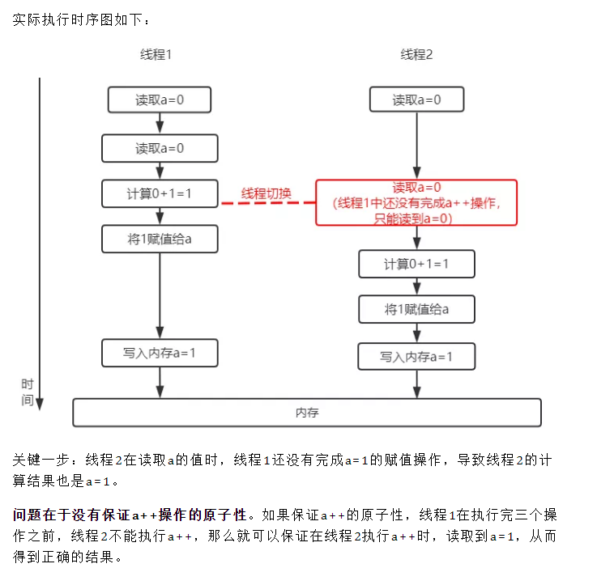
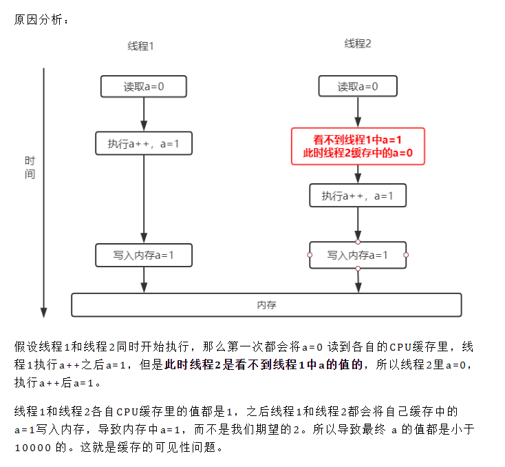
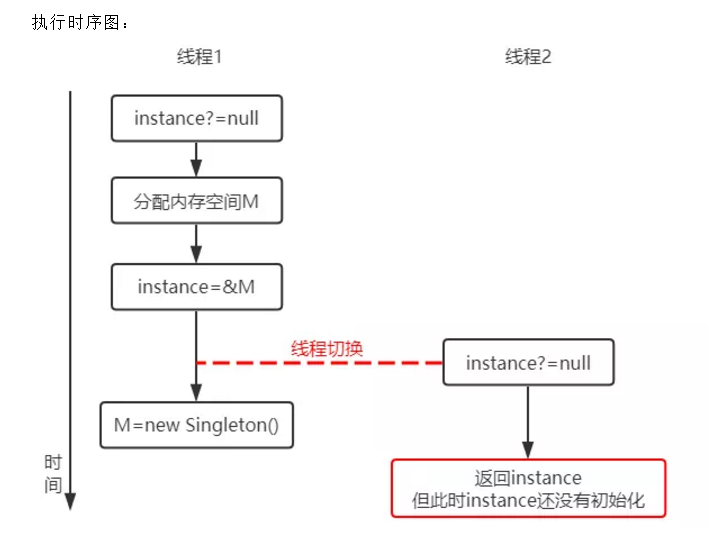

**并发编程的本质就是解决三大问题**：
原子性、可见性、有序性。

原子性：
一个或者多个操作在 CPU 执行的过程中不被中断的特性。由于线程的切换，导致多个线程同时执行同一段代码，带来的原子性问题。

可见性：
一个线程对共享变量的修改，另外一个线程能够立刻看到。缓存不能及时刷新导致了可见性问题。

有序性：
程序执行的顺序按照代码的先后顺序执行。编译器为了优化性能而改变程序中语句的先后顺序，导致有序性问题。

线程A先执行getInstance()方法，当执行完指令②时恰好发生了线程切换，切换到了线程B上；如果此时线程B也执行getInstance()方法，那么线程B在执行第一个判断时会发现instance!=null，所以直接返回instance，而此时的instance是没有初始化过的，如果我们这个时候访问instance的成员变量就可能触发空指针异常。